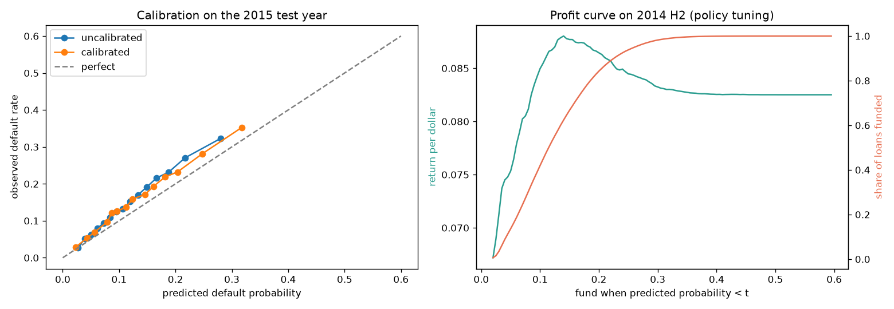
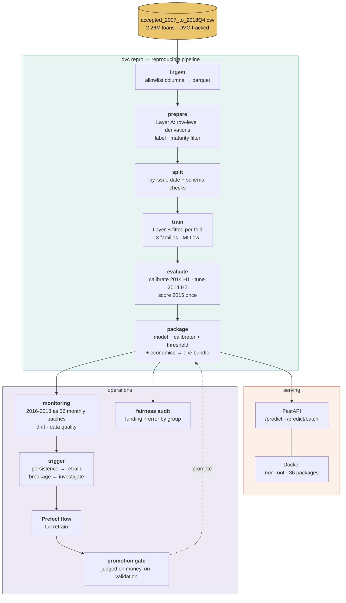
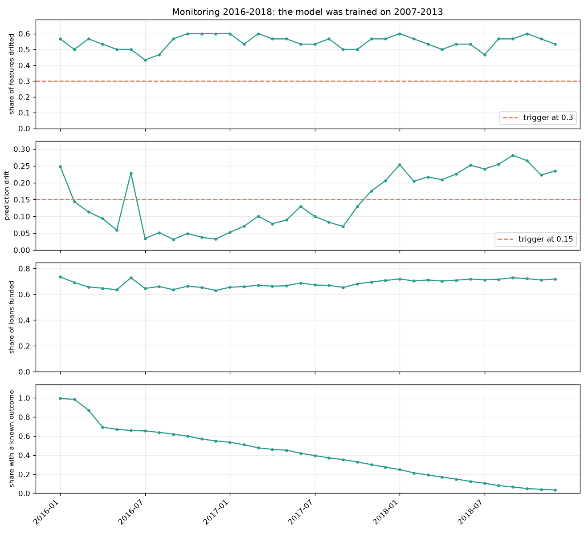

# Lending Club Loan Default - Profit-Based Funding Decisions

[](https://github.com/shikharkumar13/Lending-Club-Loan-Default-Project-MLOps/actions/workflows/ci.yml)

Read the project report here: https://shikharkumar13.github.io/Lending-Club-Loan-Default-Project-MLOps/

Predict whether a Lending Club loan will default, using **only information an
investor could see at listing time**, and fund a loan only when its
**expected profit** justifies it.

The point of the project is not the classifier. It is everything around it: a
leakage-proof pipeline, a decision rule denominated in dollars, an honest test,
a served artifact, and three years of production monitoring.

> **Status:** complete through Phase 8. Reproducible from the raw CSV with
> `dvc repro`; lint, 118 tests and a container smoke test run on every push.

| | |
|---|---|
| **Best model** | LightGBM + isotonic calibration, ROC-AUC 0.683 on 2015 |
| **Business result** | **+7.35¢ per dollar** vs. +6.55¢ funding everything, +7.18¢ for Lending Club's own grade rule |
| **Scale** | 2.26M raw loans → 621,022 matured 36-month loans → 283,026 in the test year |
| **Served as** | FastAPI + Docker, decisions verified identical to offline scoring |
| **Monitored on** | 988,585 loans issued 2016–2018, replayed as 36 monthly batches |

- [`MODEL_CARD.md`](MODEL_CARD.md) — intended use, metrics, **fairness audit**, limitations
- [`DECISIONS.md`](DECISIONS.md) — all 71 decisions, each with its reasoning
- [`PLAN.md`](PLAN.md) — the phase-by-phase plan this was built against

---

## The problem

A P2P investor sees a list of loans, each with an amount, an interest rate, a
grade and a borrower profile, and must decide which to fund. Two things make
this harder than a textbook classification task:

1. **The right metric is money, not accuracy.** 86% of loans repay, so
   "never defaults" is 86% accurate and worth nothing. A loan that defaults
   still returns ~63% of principal; a loan that repays returns less than the
   contract promises, because borrowers prepay. Only expected value ties the
   probability to a decision.
2. **Almost every column in the raw file is leakage.** `total_pymnt`,
   `recoveries`, `last_pymnt_d` and dozens more are recorded *after* the
   investor decides. A model using them scores beautifully and is worthless.

---

## Approach

**An allowlist, not a blocklist.** 29 columns are named as permitted inputs.
Anything not on the list cannot reach the model, so a future column added to the
dataset is excluded by default rather than by remembering to ban it.

**Split by time, never at random.** Train 2007–2013, tune on 2014, and score
2015 exactly once. Cross-validation uses expanding calendar-year windows, not
`TimeSeriesSplit`, which splits by row count and ignores the calendar.

**Only matured loans are labeled.** 36-month loans issued up to 2015-12, so
every one has finished by the 2018Q4 snapshot. Measured: 0.05% of 2015 loans are
unresolved versus 28% of 2016 loans, which is why 2016+ is monitoring data, not
training data.

**Preprocessing in two layers.** Row-level derivations (parsing `term`, FICO
midpoint, credit history length) run before the split, because they use only one
row's own values. Anything that *learns* a statistic — medians, percentile caps,
category frequencies, scaling — lives inside an sklearn `Pipeline`, so
cross-validation refits it per fold and a statistic can never come from a fold's
validation rows. 30 inputs become 73 features.

**Tuned on log loss.** The funding rule multiplies by the predicted probability,
so a probability that is confidently wrong must be punished. Ranking quality
alone (ROC-AUC) is not enough.

**Class imbalance is left alone.** No SMOTE, no resampling.
`class_weight="balanced"` was tested and destroys calibration, which the profit
calculation depends on.

---

## Results

### 2015 test year, scored once

| Strategy | Share funded | Return per dollar | Profit per $1B | Default rate of funded |
|---|---|---|---|---|
| Fund everything | 100% | +0.0655 | $65.5M | 14.9% |
| Lending Club grade A–B | 57.2% | +0.0718 | $71.8M | 9.1% |
| Logistic regression (tuned threshold) | 69.9% | +0.0722 | $72.2M | 10.9% |
| **LightGBM (tuned threshold)** | **66.3%** | **+0.0735** | **$73.5M** | **10.0%** |
| Logistic regression at A–B's selectivity | 59.8% | +0.0732 | $73.2M | 9.4% |
| LightGBM at A–B's selectivity | 58.0% | +0.0738 | $73.8M | 9.0% |

The rows to compare are the last two: the tuned-threshold rows fund different
shares of the book, and *any* policy looks better by being pickier.

Returns are over the ~3-year term. The model earns **12% more than funding
everything** and **2.4% more than Lending Club's own grade rule** while
deploying *more* capital than that rule.

On a 1,000-draw bootstrap of the test loans, at equal selectivity:

| Comparison | Difference per dollar | 95% CI |
|---|---|---|
| LightGBM vs. fund everything | +0.0080 | [+0.0072, +0.0087] |
| LightGBM vs. grade A–B | +0.0021 | [+0.0015, +0.0027] |
| Logistic regression vs. grade A–B | +0.0015 | [+0.0008, +0.0022] |
| **LightGBM vs. logistic regression** | **+0.0006** | **[+0.0001, +0.0011]** |

**Read that last row honestly.** LightGBM's edge over a plain logistic
regression is +0.0006 per dollar with a confidence interval that nearly touches
zero. The gap that matters — model versus no model — is four times larger. And
all of this measures sampling noise **within one test year**; it says nothing
about a different credit cycle, which is the larger risk.

### Cross-validation (expanding windows inside 2007–2013)

| Model | Log loss | ROC-AUC | PR-AUC | Brier | Configs searched |
|---|---|---|---|---|---|
| Lending Club grade (baseline) | 0.36015 | 0.6232 | 0.1663 | 0.10473 | 1 |
| Logistic regression | 0.35345 | 0.6618 | 0.2048 | 0.10331 | 3 |
| **LightGBM** | **0.35172** | **0.6672** | **0.2079** | **0.10300** | 20 |

**These averages are not the whole story, and on their own they would be
misleading.** The gap between LightGBM and logistic regression is 0.00173 log
loss; the spread *between folds* is 0.026 — fifteen times larger, because 2011,
2012 and 2013 are genuinely different years. Since that spread is common to
both models, the honest test is paired:

| Fold (validation year) | 2011 | 2012 | 2013 | Verdict |
|---|---|---|---|---|
| LightGBM | 0.31888 | 0.38146 | 0.35481 | |
| Logistic regression | 0.32006 | 0.38156 | 0.35873 | |
| **Difference** | +0.00118 | +0.00010 | +0.00392 | **wins 3/3**, mean +0.00173 ± 0.00197 |

LightGBM wins every fold, but by a margin whose variation across folds is as
large as the margin itself — and it got 20 hyperparameter draws to logistic
regression's 3, which biases the comparison in its favour. The fair summary is
"consistently ahead, by a little." Per-fold scores are kept in
`reports/cv_results.json` so this can be checked rather than taken on trust.

### The finding that shaped the design

The pure expected-value rule funds **99.9%** of loans: at these interest rates
almost everything has positive expected value. So the model's value is not
rejecting bad loans — it is **ranking under a capital constraint**. The deployed
policy is a tuned threshold, and the honest comparison is against the grade rule
*at equal selectivity*, because any policy can look good by simply being pickier.



---

## Architecture



**The bundle is the unit of deployment.** A served model is more than an
estimator: it needs the preprocessing, the calibrator fitted on 2014 H1, the
threshold tuned on 2014 H2, and the LGD/prepayment constants measured on
training loans. Shipping those separately is how production drifts out of sync
with the report — someone updates the model and forgets the threshold. Bundled,
the service either has a complete, consistent decision or it has nothing.

**Training and serving share one function.** `derive_features()` computes
`fico_mid`, `credit_history_months` and the ratio features for both the training
pipeline and the API, so training/serving skew is structurally impossible rather
than merely unlikely. Verified on 200 real 2015 loans: the container and offline
scoring agree to 4.9e-07, with identical decisions.

---

## Repository layout

```
src/lending_club/
  config.py            params.yaml loader; every path and setting flows from here
  data/                ingest → prepare (Layer A) → split
  features/            pipeline.py (Layer B, leakage-proof) · schema.py (pandera)
  models/              train.py (CV + MLflow) · baselines.py · promote.py (gate)
  policy/profit.py     LGD, prepayment, expected value, thresholds, bootstrap
  evaluate.py          calibration, policy selection, the once-only test scoring
  serving/             bundle.py · app.py (FastAPI) · schema.py (Pydantic)
  monitoring/          batches.py · drift.py (Evidently) · trigger.py
  fairness.py          funding rate and realized error by group
  testing/synthetic.py loans with planted risk, for CI

flows/retrain.py       Prefect: ingest → … → evaluate → promotion gate
notebooks/01_eda.ipynb Phase 1 exploration (calls into src/, holds no logic)
tests/                 118 tests
params.yaml            single source of configuration
dvc.yaml               the pipeline as a dependency graph
```

---

## Quick start

Requires Python 3.11 or 3.12, [uv](https://docs.astral.sh/uv/), and ~4 GB of
free disk. Docker is optional.

```bash
# 1. install (the train extra carries MLflow, DVC, Evidently, SHAP)
uv sync --extra train --extra dev        # or: pip install -r requirements.txt

# optional: a DVC remote so derived artifacts can be pushed and restored.
# A local directory is configured by default; point it at S3/GCS for real use.
#   uv run dvc remote modify localstore url s3://your-bucket/lending-club

# 2. check the install — no data needed, ~10s
uv run pytest                            # 118 tests

# 3. get the data
#    Download accepted_2007_to_2018Q4.csv from the Kaggle dataset
#    wordsforthewise/lending-club and place it at:
#      data/raw/accepted_2007_to_2018Q4.csv
#    SHA-256 3eae03c28fd9d2e8a076ebeb73507e8d4d0f44d90500decdb0936e0933d1f36a

# 4. rebuild every published number from the raw CSV (~30 min, mostly training)
uv run dvc repro
```

That produces `reports/metrics.json` (test-year results), `reports/cv_results.json`,
`reports/fairness.json`, `reports/monitoring/drift.json` and the figures in this
README.

**Explore it:**

```bash
uv run mlflow ui --backend-store-uri sqlite:///mlflow.db    # every tuning run
uv run jupyter lab notebooks/01_eda.ipynb                   # Phase 1 EDA
open reports/figures/drift.png reports/monitoring/html/2018-12.html
```

**Serve it:**

```bash
uv run uvicorn lending_club.serving.app:app --reload        # localhost:8000/docs
# or the container (port 8001 in case 8000 is taken):
docker build -t lending-club-api .
docker run -d --name lc-api -p 8001:8000 lending-club-api
curl localhost:8001/health
```

```bash
curl -X POST localhost:8001/predict -H 'content-type: application/json' \
  -d @.github/fixtures/application.json
# {"decision":"fund","decision_basis":"score_below_threshold",
#  "probability_of_default":0.1032,"expected_return_usd":1291.29,
#  "risk_score":0.1005,"threshold":0.14,"model_version":"..."}
```

The request is validated as a *loan*, not just as a set of fields: an unknown
`home_ownership`, a FICO band whose high is below its low, or an `installment`
that does not amortize from the amount, rate and term all return **422** rather
than a confident score. `decision_basis` names the rule that decided, because
funding requires both a risk score below the threshold **and** a positive
expected return.

**Retrain and monitor:**

```bash
# full retrain with the promotion gate (~100s)
PREFECT_API_URL= PREFECT_SERVER_ALLOW_EPHEMERAL_MODE=true uv run python flows/retrain.py

# replay 2016-2018 as monthly production batches (~4 min)
uv run python -m lending_club.monitoring.batches
uv run python -m lending_club.monitoring.drift
```

*(The `PREFECT_API_URL=` prefix runs the flow in-process. Drop it if you have a
Prefect server running.)*

---

## Monitoring

The 988,585 36-month loans issued 2016–2018 are replayed as 36 monthly batches,
scored by the deployed bundle.

**Most have no label, and that is the point.** A loan issued in 2018-06 has not
finished by the 2018Q4 snapshot. Outcome coverage falls from 99% to 3% across
the window, and the default rate visible on that shrinking subset swings 14.3% →
20.5% → 12.6% **purely from label maturity**. Charting it would look exactly like
a model going bad. So monitoring watches what is visible immediately: the inputs
and the model's own output.

| Measured | Result |
|---|---|
| Share of model inputs drifted vs. training | **43–60%, every month** |
| Prediction drift | 0.03 → 0.28, breaching from 2017-12 |
| Share of loans funded | stable, 0.63 → 0.73 |
| Alerts over 36 months | **3** (1 retrain, 2 investigate) |

Thirty-six months of breached thresholds produce three alerts, not thirty-six: a
retrain fires once per episode, and a new category is reported once. The two
`investigate` alerts are real findings — `addr_state=ND` and
`home_ownership=ANY` never appear in the training window.



---

## Honest limitations

Full list in [`MODEL_CARD.md`](MODEL_CARD.md). The four that matter most:

1. **`addr_state` is a proxy that earns nothing.** It produces a 26-point spread
   in funding rates by state, explained only half as well by actual default as
   other grouping columns, and removing it costs 0.00001 log loss. The model card
   recommends dropping it; it has not been dropped, because that changes every
   number above.
2. **One credit cycle.** Nothing here shows the model survives a *different*
   downturn.
3. **Ranking, not approval.** Every training loan already passed Lending Club's
   underwriting. This cannot say who should be granted credit.
4. **LGD and prepayment are single constants**, 0.3657 and 0.8288 for every loan.

---

## Data

`accepted_2007_to_2018Q4.csv` (2,260,702 rows, 1.68 GB) from the Kaggle mirror
`wordsforthewise/lending-club`. Tracked by DVC, not git — see
[D-028](DECISIONS.md#d-028-raw-data-via-manual-download-stored-as-uncompressed-csv)
for the checksum and why. Lending Club ended retail P2P lending in 2020; this is
a historical study, and the pattern transfers to fintech and bank credit risk.
